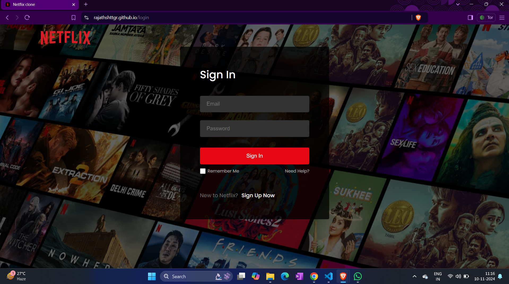
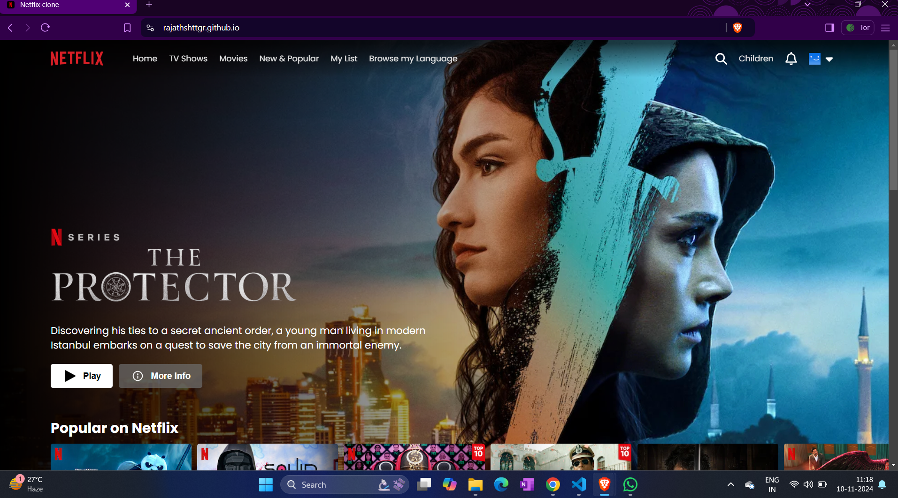
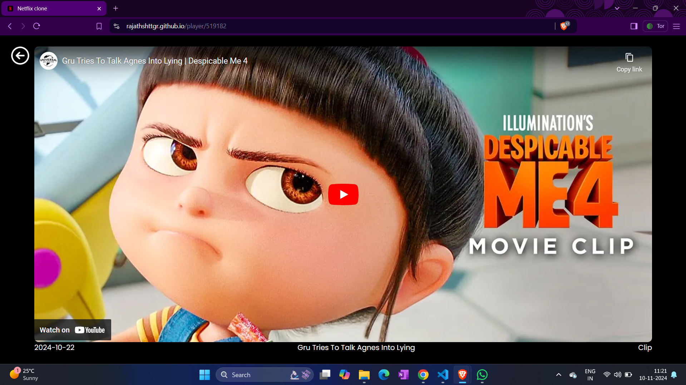
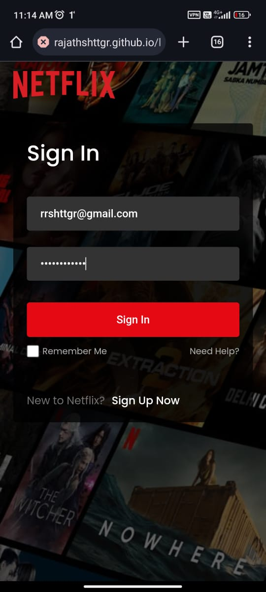
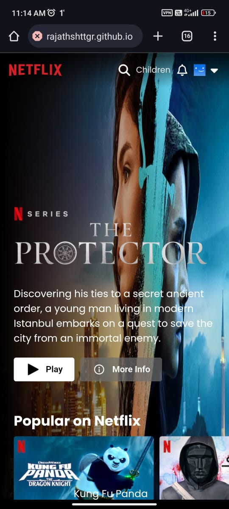
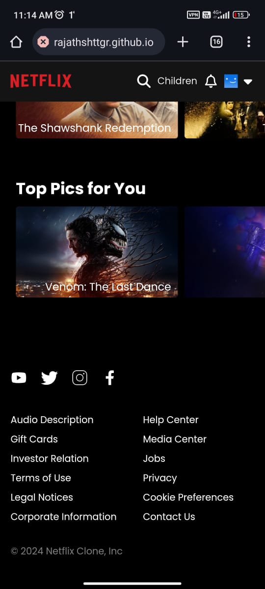

# Netflix Clone

A Netflix clone application built with React and Vite. This project emulates the look and feel of the Netflix UI and includes key features like user authentication and navigation between different sections. It demonstrates the integration of Firebase for user authentication, routing using React Router, and an organized component-based structure.

## Features

- **User Authentication**: Firebase Authentication allows users to sign up, log in, and log out securely.
- **Responsive UI**: Optimized for both mobile and desktop views, providing a seamless experience across devices.
- **React Router Integration**: Navigation between Home, Movies, TV Shows, and Profile pages with React Router.
- **Styled Components**: Modern styling for a clean, professional UI that mirrors Netflix’s look and feel.

## Tech Stack

- **Frontend**: React, Vite
- **Routing**: React Router
- **Authentication**: Firebase Authentication
- **Styling**: CSS/Styled Components

## Screenshots

### Desktop View

### Mobile View

  
  
  

